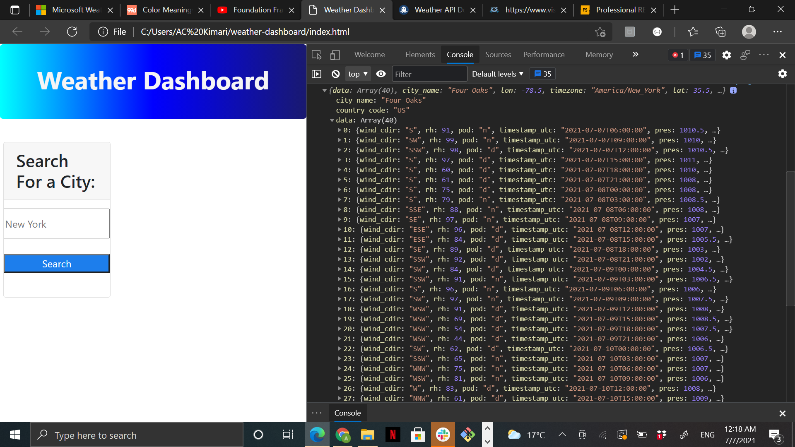

# weather-dashboard

## Description
This project was challenging yet enlightening. Building a project from scratch and utilizing an API can be a little difficult. I personally struggled to display the the weather forecast on my page. However, my API linked successfully as per the console.log. My motivation for this project was being able to ustilize an API as learned in class.

Furthermore, the purpose of this project was to provide a weather dashboard for users who wold like to know what the weather in their area or other areas are on that day and 5 days to come. Consequently, it solves the problem of not being prepared for ceratin weather changes.

I learned the areas I personally struggle with when it comes to constructing a project such as this and also learned my strengths.
## Installation
Step 1: Create the layout for the weather dashborad using HTML and CSS.

Step 2: Link weather API via Javascript.

Step 3: Work on display. Should show place, date, weather icon, weather condition, temperature, humidity, wind speed, UV index. 

Step 4: link display to API to allow live results.

## Usage

